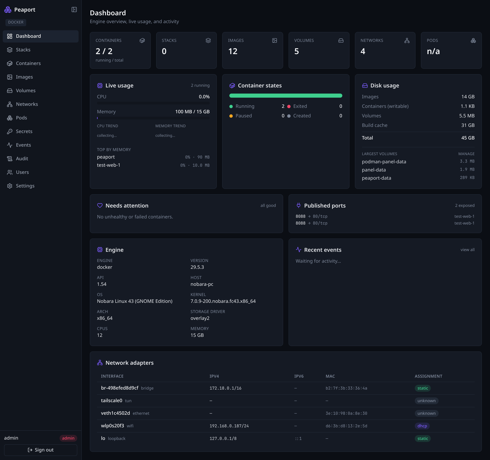
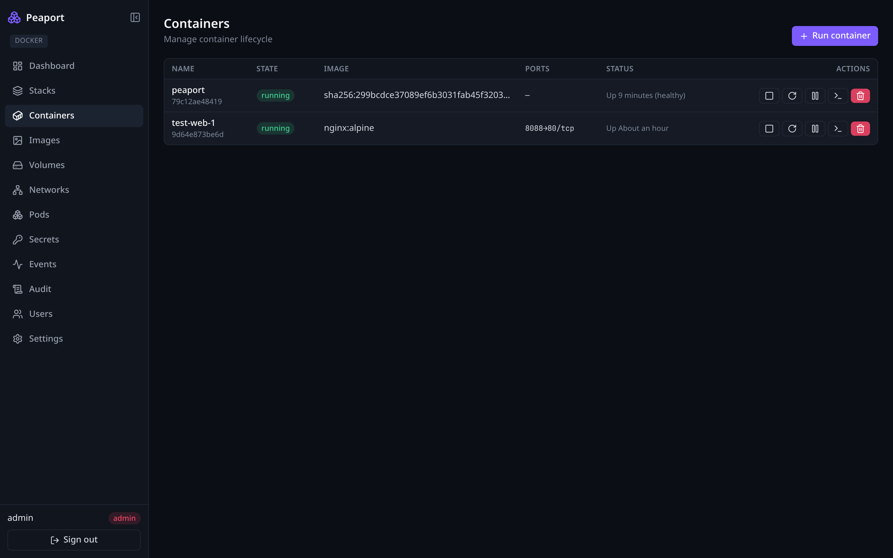
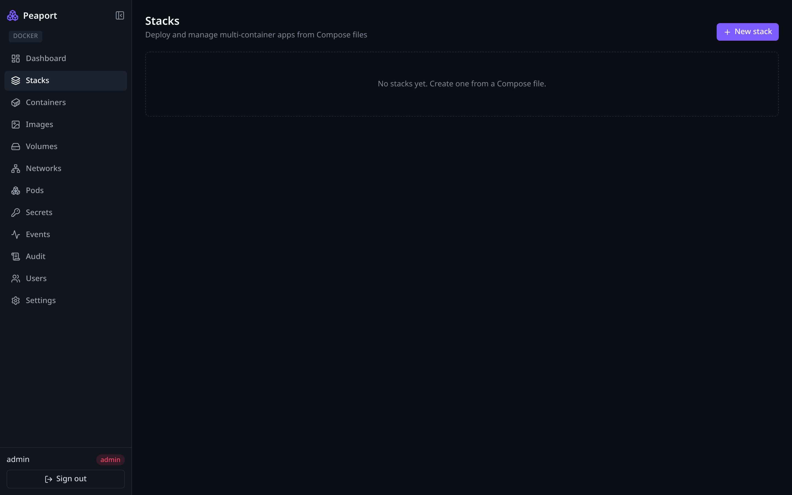
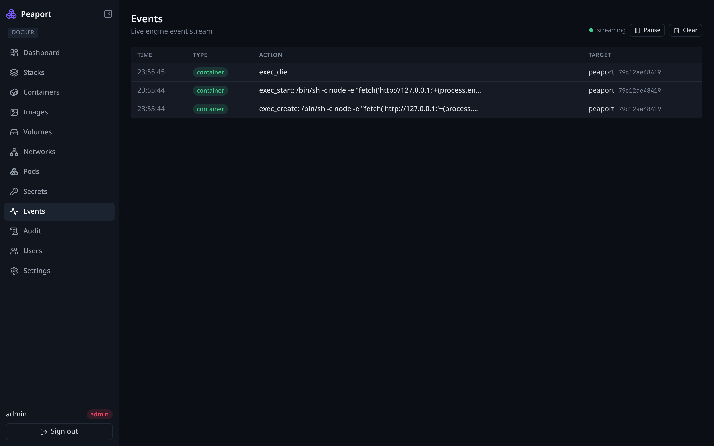

# 🫛 Peaport

[](https://github.com/Gren-95/peaport/actions/workflows/ci.yml)
[](LICENSE)


**An advanced, self-hosted web control panel for Podman and Docker.**
Manage containers, Compose stacks, images, volumes, networks and pods — with
multi-user RBAC, encrypted secrets, an audit log, live metrics, and an
in-browser terminal. One codebase drives either engine (the Podman API is
Docker-compatible).

> ⚠️ Peaport talks to the engine socket, which is **root-equivalent on the host**.
> Run it on a trusted network, behind TLS (`COOKIE_SECURE=true`) for any real exposure.

---

## Screenshots



| Containers | Stacks | Events |
|:---:|:---:|:---:|
|  |  |  |

<sub>Images browser and a mobile layout are in [`docs/img`](docs/img).</sub>

---

## Quick start

```bash
git clone https://github.com/Gren-95/peaport.git && cd peaport
./jumpstart.sh                 # auto-detects podman/docker, generates secrets, builds & runs
```

Open **http://localhost:3000** and sign in with the printed credentials
(you'll be required to set a new password on first login).

<details>
<summary>Or run the prebuilt image from GHCR (no clone/build)</summary>

```bash
docker run -d --name peaport -p 3000:3000 \
  --group-add "$(getent group docker | cut -d: -f3)" \
  -e SESSION_SECRET="$(openssl rand -hex 48)" \
  -e PODMAN_SOCKET_PATH=/var/run/docker.sock \
  -v /var/run/docker.sock:/var/run/docker.sock \
  -v peaport-data:/app/data \
  ghcr.io/gren-95/peaport:latest
```
</details>

Useful flags / overrides:

```bash
./jumpstart.sh --host-net      # host networking → the Network-adapters widget sees real NICs
./jumpstart.sh --build         # force an image rebuild
ENGINE=docker ./jumpstart.sh   # force an engine    (also: PORT=8080, COOKIE_SECURE=true)
```

<details>
<summary>Alternative: Docker/Podman Compose</summary>

```bash
export SESSION_SECRET=$(node -e "console.log(require('crypto').randomBytes(48).toString('hex'))")
export ADMIN_PASSWORD='choose-a-strong-password'
docker compose up -d --build        # or: podman-compose up -d --build
```
Edit the socket mount in `docker-compose.yml` for your engine.
</details>

<details>
<summary>Alternative: local development</summary>

Requires [bun](https://bun.sh) and a reachable engine socket.

```bash
bun install
cp .env.example .env.local     # set PODMAN_SOCKET_PATH (e.g. /var/run/docker.sock)
bun run dev                    # http://localhost:3000
```

Enable the rootless Podman socket if needed:
`systemctl --user enable --now podman.socket`
</details>

---

## Features

| Area | What you get |
|------|--------------|
| **Containers** | List/inspect, start·stop·restart·kill·pause, remove, **create/run** from a form, live **log streaming**, **stats**, and an in-browser **exec terminal** (xterm + WebSocket) |
| **Stacks** | Create/upload Compose files and manage them as stacks (up·pull·stop·restart·down·delete) with **streamed output**; status from compose project labels |
| **Secrets** | AES-256-GCM, **write-only** store; referenced in Compose as `${NAME}` and injected at deploy time — plaintext never shown or persisted in files |
| **Images / Volumes / Networks** | List, inspect, create, and **comprehensive prune** (scope + label/age filters, space reclaimed) |
| **Pods** | List, inspect, start·stop·restart, remove (Podman `libpod`; gracefully marked unsupported on Docker) |
| **Dashboard** | Live CPU/mem + sparklines, container-state split, disk usage, **attention panel**, **published ports**, **network adapters** (static/DHCP), engine warnings, recent events |
| **Users & RBAC** | `viewer` → `operator` → `admin`, enforced server-side; forced password change on first login |
| **Observability** | Real-time engine **events** feed + an append-only **audit log** (stdout-mirrored, exportable) |

### Security highlights

bcrypt password hashing · server-side sessions (idle + absolute timeouts, rotation,
revocation) · CSRF on all mutations · per-user rate limiting · nonce-based CSP,
HSTS, and other hardening headers · encrypted secrets · audit trail.
Validated against the OWASP Top 10.

---

## Configuration

All via environment variables (see [`.env.example`](.env.example)). Key ones:

| Variable | Purpose |
|----------|---------|
| `PODMAN_SOCKET_PATH` | Engine API socket (Podman rootless/rootful or Docker) |
| `SESSION_SECRET` | Signs/derives sessions — **required** in production (≥32 chars) |
| `SECRETS_KEY` | Encrypts stored secrets (falls back to `SESSION_SECRET` if unset) |
| `ADMIN_USERNAME` / `ADMIN_PASSWORD` | Bootstrap admin, created on first run |
| `PORT` · `DATA_DIR` | Listen port · SQLite location (mount as a volume) |
| `COOKIE_SECURE` | `true` behind HTTPS (enables Secure cookie + HSTS) |
| `COMPOSE_COMMAND` | Compose CLI override (default auto / `docker compose`) |

---

## Tech stack

Next.js 15 (App Router) · React 19 · TypeScript · Tailwind CSS · better-sqlite3 ·
a custom Node server for WebSocket exec · bundled Compose CLI. Package manager: **bun**.

```
Browser ──HTTP/SSE──▶ Next.js route handlers ──unix socket──▶ Podman / Docker API
        ──WebSocket──▶ server.js (exec)       ──unix socket──▶ /exec attach (hijacked)
                          └── SQLite (users · sessions · stacks · secrets · audit)
```

## Testing

```bash
bun run typecheck   # tsc --noEmit
bun run test        # unit tests (rbac, crypto, auth, audit, container spec, rate limit)
bun run build       # production build
bun run test:e2e    # Playwright golden path (forced change → pull → run → logs → remove)
```

CI runs all of the above on every push and PR.

## Contributing

See [CONTRIBUTING.md](CONTRIBUTING.md). Report security issues privately per
[SECURITY.md](SECURITY.md).

## License

Free software under the **GNU General Public License v3.0 or later**
(GPL-3.0-or-later) — see [LICENSE](LICENSE).
